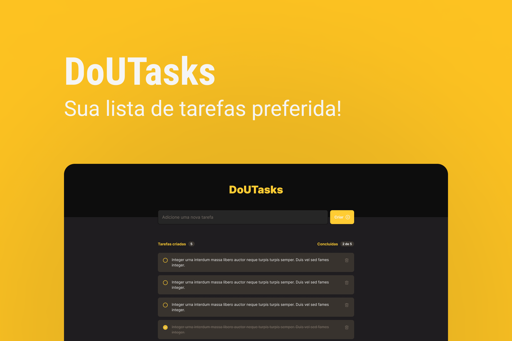

<h1 align="center"> DoUTasks </h1>

  Projeto desenvolvido para fortalecer meus conhecimentos em ReactJS, SASS e Typescript, inspirado no ToDo List, desafio da <a href="https://www.rocketseat.com.br/">Rocketseat</a>.

  <a href="#-tecnologias">Tecnologias</a>&nbsp;&nbsp;&nbsp;|&nbsp;&nbsp;&nbsp;
  <a href="#-projeto">Projeto</a>&nbsp;&nbsp;&nbsp;|&nbsp;&nbsp;&nbsp;
  <a href="#-layout">Layout</a>&nbsp;&nbsp;&nbsp;|&nbsp;&nbsp;&nbsp;
  <a href="#-contribuição">Contribuição</a>&nbsp;&nbsp;&nbsp;|&nbsp;&nbsp;&nbsp;
  <a href="#memo-licença">Licença</a>

  

 

  

## 🚀 Tecnologias

Esse projeto foi desenvolvido com as seguintes tecnologias:

- [React](https://reactjs.org/) com [TypeScript](https://www.typescriptlang.org/)
- [Node e NPM](https://nodejs.org/)
- [Vite](https://vitejs.dev/)
- [SASS](https://sass-lang.com/)
- [UUIDjs](https://www.npmjs.com/package/uuid)

## 💻 Projeto

O DoUTasks é um site onde você consegue adicionar suas tasks (tarefas) do seu dia a dia, além disso, ver quais foram criadas e concluídas, feito e pensado para você usar ele todos os dias!

[Organize suas tarefas aqui ←](https://poveii-doutasks.netlify.app/)

## 🔖 Layout

Você pode visualizar o layout do projeto através [DESSE LINK](https://www.figma.com/file/0n0zDN7zbzhRbaEO74Xesx/ToDo-List/duplicate). É necessário ter conta no [Figma](https://figma.com) para acessá-lo.

## 🫂 Contribuição

Você pode contribuir com esse pequeno projeto, criando uma issue dizendo o que você acha que esse projeto está faltando como um todo-list diário (com bastante detalhes viu?).

## :memo: Licença

Esse projeto está sob a licença MIT.

---

Feito com ❤️ by Poveii
